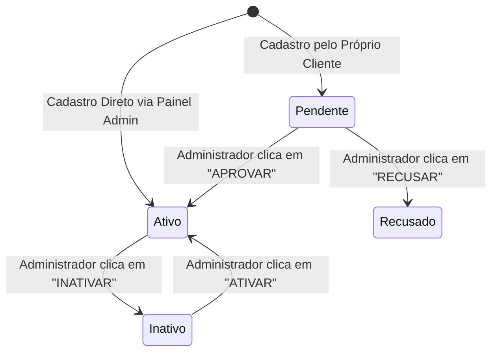
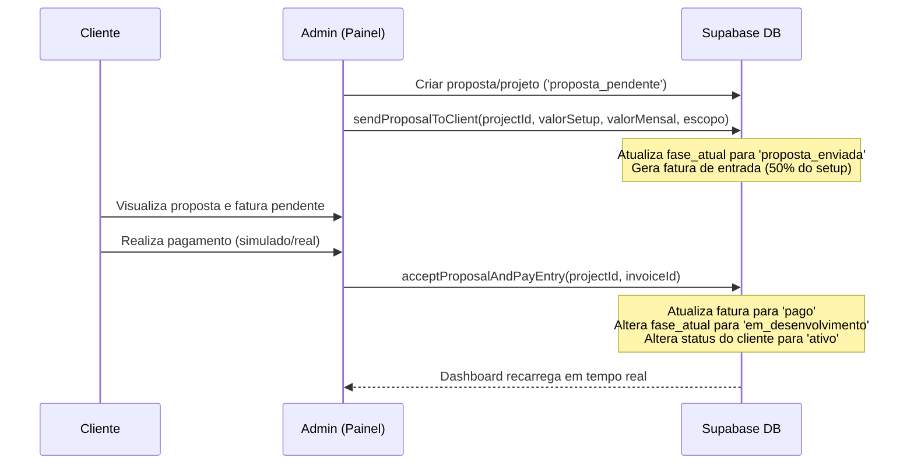

# Arquitetura Backend & Supabase - Automation Test

Este documento detalha a arquitetura de banco de dados, o modelo relacional e os fluxos de negócios do backend da plataforma **Automation Test** integrados ao **Supabase**.

---

## 1. Visão Geral da Arquitetura

A plataforma utiliza o **Supabase (PostgreSQL)** como serviço de backend (BaaS - Backend as a Service), englobando:
*   **Autenticação**: Gerenciamento de credenciais e tokens JWT.
*   **Database**: PostgreSQL relacional com validações de tipos e chaves estrangeiras.
*   **RLS (Row Level Security)**: Isolamento estrito de dados para garantir que clientes só acessem suas próprias informações (`RN-004`).

---

## 2. Esquema da Tabela `profiles`

A tabela `profiles` armazena os dados cadastrais e de status de acesso de cada usuário.

```sql
CREATE TYPE user_role AS ENUM ('admin', 'client');
CREATE TYPE user_status AS ENUM ('pendente', 'ativo', 'recusado');
CREATE TYPE tipo_pessoa AS ENUM ('PF', 'PJ');

CREATE TABLE public.profiles (
  id UUID REFERENCES auth.users(id) ON DELETE CASCADE PRIMARY KEY,
  email TEXT NOT NULL,
  role user_role DEFAULT 'client'::user_role NOT NULL,
  status user_status DEFAULT 'pendente'::user_status NOT NULL,
  tipo_pessoa tipo_pessoa NOT NULL,
  razao_social TEXT,
  cnpj TEXT,
  nome_completo TEXT,
  cpf TEXT,
  data_nascimento DATE,
  telefone TEXT,
  endereco JSONB,
  created_at TIMESTAMPTZ DEFAULT timezone('utc'::text, now()) NOT NULL,
  updated_at TIMESTAMPTZ DEFAULT timezone('utc'::text, now()) NOT NULL
);
```

---

## 3. Fluxo de Transição de Estado de Cadastro (`pendente` ➔ `ativo`/`recusado`/`inativo`)

O ciclo de vida do perfil de usuário segue um fluxo atômico controlado exclusivamente pelo Administrador Master:



### Detalhamento dos Estados:

1. **`pendente` (Solicitação Inicial)**: Cadastro realizado pelo cliente no site público (badge Amarelo Alerta).
2. **`ativo` (Conta Liberada)**: Acesso total liberado (badge Verde Neon `#a3e635`). Cadastros criados diretamente pelo Administrador no módulo `/admin/clientes` recebem automaticamente o status `ativo`.
3. **`recusado` (Solicitação Negada)**: Acesso bloqueado (badge Vermelho Rosé).
4. **`inativo` (Conta Desativada)**: Conta suspensa operacionalmente (badge Cinza Muted).

---

## 4. Regras de Negócio de Gestão de Clientes e CRUD

* **Regra de Proibição Absoluta de Deleção Física (No-DELETE Policy)**:
  - É estritamente proibida a remoção física de registros da tabela `profiles`.
  - A desativação de clientes é feita exclusivamente através da alteração do status para `inativo` (`updateProfileStatus(id, 'inativo')`), preservando o histórico de dados e integridade referencial.
* **Atribuição Automática de Status via Admin**:
  - Quando um novo cliente é cadastrado pelo Administrador no modal `ClientModal.tsx`, a função `createAdminClient` atribui automaticamente os campos `role: 'client'` e `status: 'ativo'`.

---

## 5. Camada de Serviços de Perfis (`src/services/profileServices.ts`)

* `fetchAllProfiles()`: Busca todos os perfis ordenados pela data de criação.
* `getPendingProfiles()`: Retorna exclusivamente cadastros com `status === 'pendente'`.
* `updateProfileStatus(id, status)`: Atualiza o status (`pendente` | `ativo` | `recusado` | `inativo`).
* `createAdminClient(data)`: Inserção de novo cliente com status `ativo`.
* `updateClientProfile(id, data)`: Edição dos dados cadastrais (Nome/Razão Social, Documento, E-mail, Telefone).

---

## 6. Esquema da Tabela `products` (Catálogo de Soluções)

A tabela `products` armazena as soluções tecnológicas oferecidas pela plataforma e seus respectivos modelos de precificação.

```sql
CREATE TYPE product_category AS ENUM (
  'design_web', 'desenvolvimento', 'erp_saas', 'automacao', 'ia'
);

CREATE TYPE pricing_type AS ENUM ('unico', 'recorrente', 'hibrido');

CREATE TABLE public.products (
  id UUID DEFAULT gen_random_uuid() PRIMARY KEY,
  nome TEXT NOT NULL,
  slug TEXT NOT NULL UNIQUE,
  rotulo TEXT,
  categoria product_category NOT NULL,
  tipo_cobranca pricing_type DEFAULT 'unico'::pricing_type NOT NULL,
  preco_setup DECIMAL(10,2) DEFAULT 0.00,
  preco_mensal DECIMAL(10,2) DEFAULT 0.00,
  descricao_curta TEXT NOT NULL,
  descricao_completa TEXT,
  recursos JSONB DEFAULT '[]'::jsonb,
  icone TEXT DEFAULT 'Package',
  status BOOLEAN DEFAULT true NOT NULL,
  created_at TIMESTAMPTZ DEFAULT timezone('utc'::text, now()) NOT NULL,
  updated_at TIMESTAMPTZ DEFAULT timezone('utc'::text, now()) NOT NULL
);
```

---

## 7. Camada de Serviços de Produtos (`src/services/productServices.ts`)

* `fetchAllProducts()`: Lista todos os produtos da tabela `products` ordenados por data.
* `fetchActiveProducts()`: Busca produtos ativos (`status === true`) do Supabase, aplicando tratamento de erro resiliente com fallback local para `productsData.ts` caso haja falha de RLS ou indisponibilidade.
* `createProduct(data)`: Inserção de novos produtos no catálogo.
* `updateProduct(id, data)`: Atualização dos dados de um produto existente (Preço, Categoria, Recursos).
* `toggleProductStatus(id, currentStatus)`: Alterna o status `active` (`true` / `false`).
* **Regra de Inativação sem Deleção**: Exclusões físicas via `DELETE` são desabilitadas; desativações ocorrem alterando `active` para `false`.

---

## 8. Ciclo de Atualização Reativa das Métricas do Painel Admin

No componente `AdminOverview.tsx`, as métricas operacionais superiores são calculadas dinamicamente sobre o estado local `profiles`, sincronizado com a consulta direta ao Supabase:

1. **Inicialização (`useEffect`)**:
   - Invocação da função `loadProfiles()`, executando `fetchAllProfiles()` para obter o array completo de perfis cadastrados no PostgreSQL.
2. **Cálculo Derivado de Métricas**:
   - **Total de Clientes Ativos**: Calculado via `profiles.filter(p => p.status === 'ativo').length`.
   - **Solicitações Pendentes**: Calculado via `profiles.filter(p => p.status === 'pendente').length`.
3. **Ciclo de Atualização Reativa (`handleStatusChange`)**:
   - Ao acionar os botões `APROVAR`, `RECUSAR`, `INATIVAR` ou `ATIVAR`, a função `updateProfileStatus(userId, newStatus)` executa a alteração atômica no banco de dados.
   - Em caso de sucesso, `loadProfiles()` é invocado novamente para recarregar o estado `profiles`, recomputando instantaneamente os contadores e atualizando a interface gráfica com feedback visual (Toast).

---

## 9. Tabelas de Projetos e Faturas (`projects` e `invoices`)

### Tabela `projects`
```sql
CREATE TYPE project_phase AS ENUM (
  'proposta_pendente', 'proposta_enviada', 'aguardando_pagamento',
  'em_desenvolvimento', 'homologacao', 'concluido', 'recusado'
);

CREATE TABLE public.projects (
  id UUID DEFAULT gen_random_uuid() PRIMARY KEY,
  client_id UUID REFERENCES public.profiles(id) ON DELETE CASCADE,
  nome TEXT NOT NULL,
  descricao TEXT,
  data_inicio TEXT,
  previsao_entrega TEXT,
  fase_atual project_phase DEFAULT 'proposta_pendente'::project_phase NOT NULL,
  proxima_entrega TEXT,
  status_pagamento TEXT,
  status_geral TEXT,
  url_projeto TEXT,
  btn_online_label TEXT,
  btn_gerenciar_label TEXT,
  progresso INTEGER,
  ativo BOOLEAN DEFAULT true NOT NULL,
  valor_setup DECIMAL(10,2) DEFAULT 0.00,
  valor_mensalidade DECIMAL(10,2) DEFAULT 0.00,
  created_at TIMESTAMPTZ DEFAULT timezone('utc'::text, now()) NOT NULL
);
```

### Tabela `invoices`
```sql
CREATE TYPE invoice_status AS ENUM ('pendente', 'pago', 'cancelado');
CREATE TYPE invoice_type AS ENUM ('entrada', 'mensalidade', 'avulso');

CREATE TABLE public.invoices (
  id UUID DEFAULT gen_random_uuid() PRIMARY KEY,
  project_id UUID REFERENCES public.projects(id) ON DELETE CASCADE,
  client_id UUID REFERENCES public.profiles(id) ON DELETE CASCADE,
  valor DECIMAL(10,2) NOT NULL,
  vencimento DATE NOT NULL,
  tipo invoice_type NOT NULL,
  status invoice_status DEFAULT 'pendente'::invoice_status NOT NULL,
  created_at TIMESTAMPTZ DEFAULT timezone('utc'::text, now()) NOT NULL
);
```

---

## 10. Fluxo Comercial Completo da Proposta


