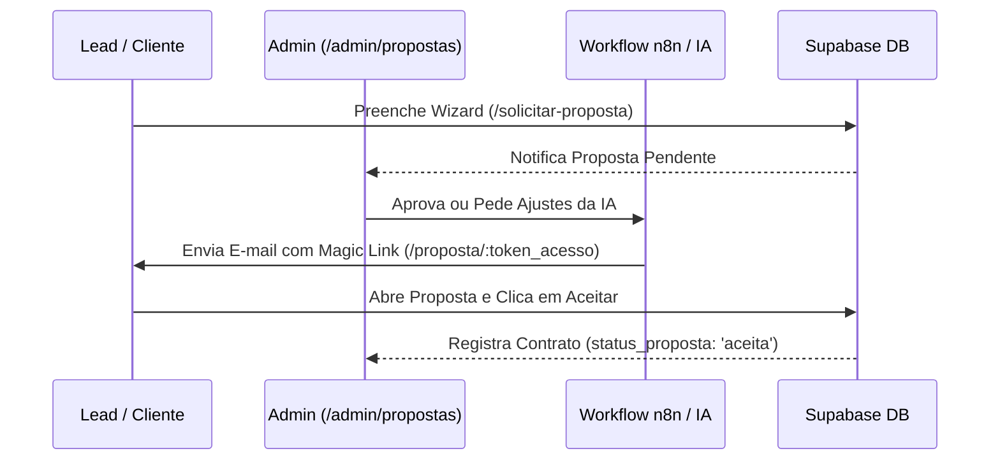

# Arquitetura Backend & Supabase - Automation Test

Este documento detalha a arquitetura de banco de dados, o modelo relacional e os fluxos de negócios do backend da plataforma **Automation Test** integrados ao **Supabase**.

---

## 1. Visão Geral da Arquitetura

A plataforma utiliza o **Supabase (PostgreSQL)** como serviço de backend (BaaS - Backend as a Service), englobando:
*   **Autenticação**: Gerenciamento de credenciais e tokens JWT.
*   **Database**: PostgreSQL relacional com validações de tipos e chaves estrangeiras.
*   **RLS (Row Level Security)**: Isolamento estrito de dados para garantir que clientes só acessem suas próprias informações (`RN-004`).

---

## 2. Esquema da Tabela `profiles` (V2 Unificado)

A tabela `profiles` armazena os dados cadastrais e de status de acesso de cada usuário, totalmente vinculada ao `auth.users` do Supabase.

```sql
CREATE TYPE user_role AS ENUM ('admin', 'client');
CREATE TYPE user_status AS ENUM ('lead', 'pendente', 'ativo', 'recusado', 'inativo');
CREATE TYPE tipo_pessoa AS ENUM ('PF', 'PJ');

CREATE TABLE public.profiles (
  id UUID PRIMARY KEY REFERENCES auth.users(id) ON DELETE CASCADE,
  email TEXT NOT NULL UNIQUE,
  role user_role DEFAULT 'client'::user_role NOT NULL,
  status user_status DEFAULT 'lead'::user_status NOT NULL,
  tipo_pessoa tipo_pessoa DEFAULT 'PF'::tipo_pessoa NOT NULL,
  razao_social TEXT,
  cnpj TEXT,
  nome_completo TEXT,
  cpf TEXT,
  telefone TEXT,
  endereco JSONB DEFAULT '{}'::jsonb,
  created_at TIMESTAMPTZ DEFAULT timezone('utc'::text, now()) NOT NULL,
  updated_at TIMESTAMPTZ DEFAULT timezone('utc'::text, now()) NOT NULL
);
```

> **Trigger Automático de Cadastro (`handle_new_user`)**: Ao criar um usuário via `auth.users` (Supabase Auth), uma nova linha é criada automaticamente na tabela `profiles` com `status: 'lead'`.

---

## 3. Esquema Oficial da Tabela `public.proposals`

A tabela `public.proposals` é o núcleo da esteira comercial de Inteligência Artificial e aprovação humana do admin.

```sql
create table public.proposals (
  id uuid not null default gen_random_uuid (),
  lead_id uuid not null,
  token_acesso text not null default encode(extensions.gen_random_bytes (24), 'hex'::text),
  resumo_executivo text not null,
  valor_total_setup numeric(10, 2) not null,
  valor_entrada_50 numeric(10, 2) not null,
  mensalidade_recorrente numeric(10, 2) null default 0.00,
  prazo_estimado_dias integer not null,
  entregaveis_principais jsonb not null default '[]'::jsonb,
  sugestoes_upsell jsonb null default '[]'::jsonb,
  dicas_engenharia text null,
  status_proposta text null default 'pendente_aprovacao_admin'::text,
  observacoes_admin text null,
  contador_recriacoes integer null default 1,
  created_at timestamp with time zone not null default timezone ('utc'::text, now()),
  updated_at timestamp with time zone not null default timezone ('utc'::text, now()),
  orientacao_admin_refazer text null,
  constraint proposals_pkey primary key (id),
  constraint proposals_token_acesso_key unique (token_acesso),
  constraint proposals_lead_id_fkey foreign KEY (lead_id) references leads (id) on delete CASCADE,
  constraint proposals_status_proposta_check check (
    status_proposta = any (array['pendente_aprovacao_admin'::text, 'aprovada_admin'::text, 'enviada_lead'::text, 'aceita'::text, 'recusada'::text])
  )
);
```

---

## 4. Esquema da Tabela `public.contracts`

Registra o aceite oficial do contrato comercial realizado pelo cliente.

```sql
create table public.contracts (
  id uuid not null default gen_random_uuid (),
  proposal_id uuid not null,
  lead_id uuid not null,
  valor_setup_base numeric(10, 2) not null,
  modulos_upsell_selecionados jsonb null default '[]'::jsonb,
  valor_total_contrato numeric(10, 2) not null,
  valor_entrada_50 numeric(10, 2) not null,
  mensalidade_recorrente numeric(10, 2) null default 0.00,
  status_contrato text null default 'aguardando_pagamento_entrada'::text,
  token_acesso text null,
  data_aceite timestamp with time zone not null default timezone ('utc'::text, now()),
  created_at timestamp with time zone not null default timezone ('utc'::text, now()),
  updated_at timestamp with time zone not null default timezone ('utc'::text, now()),
  constraint contracts_pkey primary key (id),
  constraint contracts_proposal_id_fkey foreign key (proposal_id) references proposals (id) on delete cascade
);
```

---

## 5. Fluxo Comercial Completo da Proposta com Magic Link



---

## 6. Rotas de Navegação SPA & Suporte Vercel (`vercel.json`)

Para evitar erros de HTTP 404 em navegações diretas da SPA no deploy da Vercel, o arquivo `vercel.json` na raiz da aplicação reescreve todas as chamadas para `index.html`:

```json
{
  "rewrites": [
    {
      "source": "/(.*)",
      "destination": "/index.html"
    }
  ]
}
```

### Rotas Ativas
- `/solicitar-proposta`: Wizard de captação de leads.
- `/admin/propostas`: Painel da esteira comercial com filtros e contadores.
- `/admin/propostas/:id`: Detalhe da proposta para aprovação humana e recriação IA.
- `/proposta/:token`: Visualização da proposta pública pelo cliente usando `token_acesso`.
