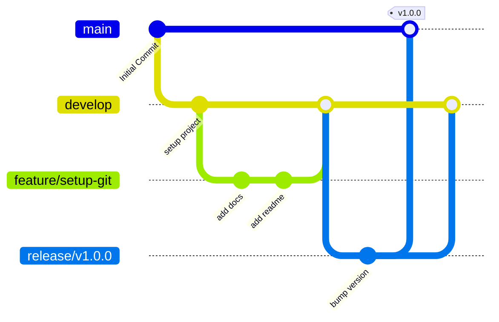

# Fluxo de Trabalho Git - Automation Test

Este guia define a convenção de ramificação (branching), nomenclatura de branches, padronização de commits e o processo de Pull Request a ser seguido por toda a equipe do projeto **Automation Test**.

---

## 1. Estrutura de Branches

Utilizaremos uma versão simplificada e ágil do **Git Flow** focada em entregas contínuas e seguras:



### Branches Principais
*   **`main`**: Armazena o código estável de produção. Cada merge na `main` corresponde a uma nova versão de release disponível para os usuários finais.
*   **`develop`**: Ramo de integração de todas as novas funcionalidades concluídas. É a base estável mais recente para o desenvolvimento.

### Branches de Suporte
*   **`feature/*`**: Criada a partir de `develop` para desenvolvimento de novas funcionalidades, refatorações ou tarefas de setup.
    *   *Exemplo*: `feature/setup-git-docs`, `feature/landing-page-hero`
*   **`hotfix/*`**: Criada diretamente de `main` para correção de bugs críticos em ambiente de produção. Após a correção, é integrada de volta para a `main` e `develop`.
    *   *Exemplo*: `hotfix/auth-leak-fix`
*   **`release/*`**: Criada a partir de `develop` para preparação de uma nova versão estável antes de fundir com a `main`.

---

## 2. Padrão de Commits (Conventional Commits)

Adotamos a especificação dos **Conventional Commits** para manter o histórico de alterações limpo, legível e passível de automação de changelogs.

A estrutura da mensagem de commit deve seguir o formato:
```text
<tipo>(<escopo-opcional>): <descrição curta em letras minúsculas>
```

### Tipos Permitidos

| Tipo | Significado | Exemplo |
| :--- | :--- | :--- |
| **`feat`** | Nova funcionalidade para o usuário final | `feat(auth): adiciona fluxo de login com supabase` |
| **`fix`** | Correção de um bug ou erro no código | `fix(dashboard): corrige quebra de layout no safari` |
| **`docs`** | Alteração exclusiva em arquivos de documentação | `docs(design): documenta paleta de cores tech-luxo` |
| **`style`** | Alterações visuais ou de formatação que não afetam a lógica (espaços, ponto e vírgula, etc.) | `style(tailwind): formata identação de arquivos de estilo` |
| **`refactor`** | Mudança no código que não corrige bug nem adiciona funcionalidade | `refactor(utils): otimiza função de formatação de moeda` |
| **`perf`** | Alteração de código com foco puramente em desempenho | `perf(motion): otimiza renders das animações de cards` |
| **`test`** | Adiciona ou modifica testes existentes | `test(auth): implementa testes unitários do helper de validação` |
| **`chore`** | Atualizações em tarefas de build, pacotes npm, configurações de CI/CD ou infraestrutura | `chore(deps): instala postcss e tailwindcss` |

---

## 3. Fluxo para Novas Funcionalidades (Ciclo de Feature)

1.  Garantir que a branch local `develop` está atualizada:
    ```bash
    git checkout develop
    git pull origin develop
    ```
2.  Criar uma nova branch de feature:
    ```bash
    git checkout -b feature/nome-da-feature
    ```
3.  Desenvolver e commitar o código seguindo o padrão de commits convencionais.
4.  Subir a branch para o repositório remoto:
    ```bash
    git push origin feature/nome-da-feature
    ```
5.  Abrir um **Pull Request (PR)** da branch `feature/nome-da-feature` direcionado para a branch `develop`.
6.  Aguardar a aprovação da revisão do Tech Lead e os testes integrados de CI passarem.
7.  Realizar o Merge (preferencialmente usando a estratégia de *Squash and Merge* para manter o histórico limpo na develop).
